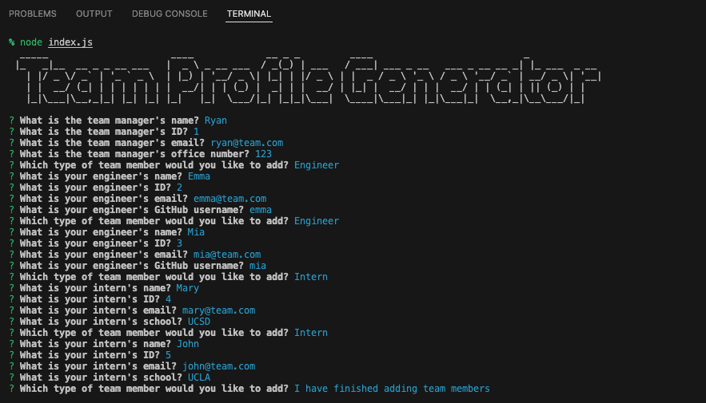

# Team Profile Generator - Node.js Project


## Description
The Team Profile Generator is a Node.js command-line application that helps to generate an HTML page for a software engineering team after taking inputs from users. 

The application starts with prompting questions for the team manager, then provides an option to select which type of team members to add to the team. The user can select engineer or intern, then the associated questions will be displayed based on the type of team member that has been selected. User also has the option to stop adding more member to the team. 

Once all of the questions/prompts have been completed, an HTML page will be generated based on the user inputs in the dist/ folder.


## Table of Contents 

- [Description](#description)
- [Installation](#installation)
- [Usage](#usage)
- [Technology](#technology)
- [Credits](#credits)
- [Assets](#assets)
- [Link](#link)
- [Tests](#tests)
- [License](#license)

## Installation

The Team Profile Generator is functioning with the npm Inquirer.js, Jest, and Figlet

Here is a simple installation instruction: After cloning the Repo to your computer
- Open the terminal and find the directory where the Repo has been cloned to
- Enter the following commands:
    - `npm init -y` - to generate the package.json and package-lock.json
    - `nmp i inquirer` - to install Inquirer
    - `npm i jest` - to install Jest
    - `npm i figlet` - to install Figlet
- Make sure your Repo has the .gitignore file which includes `node_modules` and `.DS_Store` (for macOS) before installing any npm dependencies

## Usage

Please follow the usage instruction here:
- Clone this Repo to your computer
- Follow the installation instruction above to install npm Inquirer, npm Jest and Figlet
    - This app will use Jest for running the unit tests
    - This app will use Inquirer for collecting user input
- Open the terminal and go to the directory that this Repo has been cloned to
- Type the following commands in terminal: 
    - To run the unit tests: `npm test`
    - To start the app: `node index.js`
- Answer the prompts/questions that displayed in your terminal
    - For the question "Which type of team member would you like to add?"
        - Select either Engineer or Intern to view the associated questions OR
        - Select "I have finished adding team members" to stop adding more team member
- After completing all of the prompts/questions, a message **"Created team.html file. You'll find it in the 'dist' folder."** with be displayed in the terminal.
    - You will see the new team.html file is generated in the `dist/` folder

## Technology
```md
JavaScript
CSS
Node.js
```

## Credits

- The Team Profile Generator is functioning with [npm Inquirer.js](https://www.npmjs.com/package/inquirer), [npm Jest](https://www.npmjs.com/package/jest) and [npm Figlet](https://www.npmjs.com/package/figlet)

- The unit tests are provided by The Coding Boot Camp | UC San Diego Extension | Trilogy Education Services, LLC


## Assets

The following images demonstrate the Team Profile Generator's functionality:

In terminal:



Unit tests:


Sample HTML that generated by this app:


**Please find this sample team.html file in the `dist/` folder in this Repo**

## Link

Please click [here](https://watch.screencastify.com) to find the walkthrough video that demonstrates the functionality of the Team Profile Generator.

## Tests

The unit tests have been included in the `__tests__/` folder. There are 4 test suites, 17 tests in total. 
- Enter `npm test` in terminal to run the tests

## License

Copyright (c) 2022 Elaine D. This project is licensed under the terms of the MIT license.
